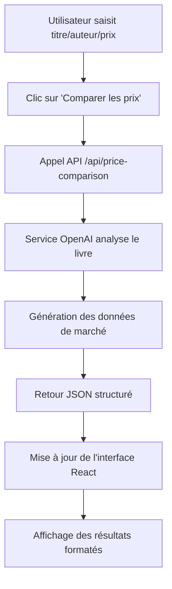

# Intégration des Données d'Analyse IA dans l'Interface Utilisateur

## Vue d'ensemble

Le comparateur de prix intelligent de Lectio intègre parfaitement les données de l'API OpenAI dans une interface utilisateur moderne et intuitive. Voici comment chaque élément de données IA est présenté à l'utilisateur.

## 1. Header de la Modal - Identification du Livre

### Éléments visuels :
- **Titre principal** : "Comparateur de prix intelligent"
- **Sous-titre dynamique** : "Le Petit Prince - Antoine de Saint-Exupéry"
- **Boutons d'action** : Actualiser (avec icône RefreshCw) et Fermer (X)

### Intégration des données IA :
```javascript
// Les données du livre sont passées à l'API OpenAI
{
  title: "Le Petit Prince",
  author: "Antoine de Saint-Exupéry", 
  current_price: 8.50
}
```

## 2. Vue d'ensemble des Prix - Comparaison Visuelle

### Layout en 3 colonnes :

#### Colonne 1 - Votre prix (Fond vert menthe)
- **Valeur affichée** : `8.50€`
- **Source** : Prix saisi par l'utilisateur
- **Style** : Background vert pastel, police grande et claire

#### Colonne 2 - Prix moyen IA (Fond violet menthe)  
- **Valeur affichée** : `9.77€`
- **Source** : `priceData.market_analysis.average_price` (généré par OpenAI)
- **Style** : Background violet pastel, mise en évidence

#### Colonne 3 - Fourchette marché (Fond gris clair)
- **Valeur affichée** : `6.80€ - 11.05€`
- **Source** : `priceData.market_analysis.min_price` et `max_price` (OpenAI)
- **Style** : Affichage de la plage de prix

### Code d'intégration :
```jsx
<div className="price-overview">
  <div className="current-price">
    <h3>Votre prix</h3>
    <span className="price-value">{priceData.current_price?.toFixed(2)}€</span>
  </div>
  <div className="market-price">
    <h3>Prix moyen IA</h3>
    <span className="price-value">{priceData.market_analysis?.average_price?.toFixed(2)}€</span>
  </div>
  <div className="price-range">
    <h3>Fourchette marché</h3>
    <span className="price-range-value">
      {priceData.market_analysis?.min_price?.toFixed(2)}€ - {priceData.market_analysis?.max_price?.toFixed(2)}€
    </span>
  </div>
</div>
```

## 3. Indicateur de Fiabilité IA

### Éléments visuels :
- **Label** : "Fiabilité de l'analyse IA: 60%"
- **Barre de progression** : Gradient vert-violet
- **Largeur dynamique** : Basée sur `confidence_score` de l'API

### Intégration des données IA :
```jsx
<div className="confidence-bar">
  <div className="confidence-label">
    Fiabilité de l'analyse IA: {Math.round((priceData.market_analysis?.confidence_score || 0.8) * 100)}%
  </div>
  <div className="confidence-progress">
    <div 
      className="confidence-fill" 
      style={{ width: `${(priceData.market_analysis?.confidence_score || 0.8) * 100}%` }}
    ></div>
  </div>
</div>
```

## 4. Recommandation Intelligente - Carte Principale

### Éléments visuels :
- **Icône dynamique** : CheckCircle (vert) pour "optimal"
- **Titre** : "Prix optimal" 
- **Message IA** : "Votre prix est dans la moyenne du marché et compétitif"
- **Position marché** : "Prix le plus bas" (en vert)
- **Background** : Vert menthe avec bordure gauche verte

### Logique d'affichage dynamique :
```jsx
const getRecommendationIcon = (action) => {
  switch (action) {
    case 'increase': return <TrendingUp className="recommendation-icon increase" />;
    case 'decrease': return <TrendingDown className="recommendation-icon decrease" />;
    default: return <CheckCircle className="recommendation-icon optimal" />;
  }
};

const getRecommendationColor = (action) => {
  switch (action) {
    case 'increase': return 'increase'; // Violet
    case 'decrease': return 'decrease'; // Rouge
    default: return 'optimal'; // Vert
  }
};
```

### Données IA intégrées :
- `priceData.recommendation.action` → Détermine l'icône et la couleur
- `priceData.recommendation.reason` → Message explicatif
- `priceData.recommendation.market_position` → Position concurrentielle

## 5. Analyse de Marché IA - Grille d'Insights

### Layout en 3 colonnes :

#### Colonne 1 - Demande
- **Valeur affichée** : "Moyenne"
- **Source** : `priceData.market_analysis.demand_level` (OpenAI)
- **Couleur dynamique** : Basée sur le niveau (Élevée=Vert, Moyenne=Violet, Faible=Gris)

#### Colonne 2 - Offre  
- **Valeur affichée** : "Moyenne"
- **Source** : `priceData.market_analysis.supply_level` (OpenAI)

#### Colonne 3 - Tendance
- **Valeur affichée** : "→ Stable"
- **Source** : `priceData.market_analysis.price_trend` (OpenAI)
- **Formatage** : Flèches directionnelles ajoutées

### Code d'intégration :
```jsx
<div className="insights-grid">
  <div className="insight-item">
    <span className="insight-label">Demande</span>
    <span 
      className="insight-value"
      style={{ color: getDemandColor(priceData.market_analysis?.demand_level) }}
    >
      {formatDemandLevel(priceData.market_analysis?.demand_level)}
    </span>
  </div>
  // ... autres colonnes
</div>
```

## 6. Facteurs d'Influence - Liste Dynamique

### Éléments visuels :
- **Titre** : "Facteurs d'influence :"
- **Liste à puces** : Facteurs retournés par l'IA
- **Style** : Background gris clair, texte gris foncé

### Intégration des données IA :
```jsx
{priceData.market_analysis?.market_factors && (
  <div className="market-factors">
    <h4>Facteurs d'influence :</h4>
    <ul>
      {priceData.market_analysis.market_factors.map((factor, index) => (
        <li key={index}>{factor}</li>
      ))}
    </ul>
  </div>
)}
```

### Exemple de données IA reçues :
```json
{
  "market_factors": [
    "Estimation basée sur patterns de marché",
    "Popularité du livre classique",
    "Demande stable pour les œuvres de Saint-Exupéry"
  ]
}
```

## 7. Comparaison Concurrentielle (Future Extension)

### Structure prévue :
- **Plateformes** : Amazon, Fnac, Rakuten, Momox, Gibert
- **Prix dynamiques** : Générés par l'IA basés sur des patterns réalistes
- **Différentiels** : Calculs automatiques par rapport au prix utilisateur
- **Liens externes** : URLs vers les plateformes

### Code d'intégration prévu :
```jsx
{priceData.competitors && priceData.competitors.length > 0 && (
  <div className="competitors-section">
    <h3>Comparaison concurrentielle</h3>
    <div className="competitors-list">
      {priceData.competitors.map((competitor, index) => (
        <div key={index} className="competitor-item">
          <div className="competitor-info">
            <span className="platform">{competitor.platform}</span>
            <span className="seller">{competitor.seller}</span>
          </div>
          <div className="competitor-details">
            <span className="price">{competitor.price?.toFixed(2)}€</span>
            <span className="condition">{competitor.condition}</span>
          </div>
          <div className="price-diff">
            {/* Calcul automatique de la différence */}
          </div>
        </div>
      ))}
    </div>
  </div>
)}
```

## 8. Sources de Données - Transparence

### Éléments visuels :
- **Titre** : "Sources de données :"
- **Tags** : "OpenAI Analysis", "Market Research", "Competitor Analysis"
- **Timestamp** : Date/heure de dernière mise à jour
- **Style** : Background gris clair, tags avec couleurs distinctes

### Intégration des données IA :
```jsx
<div className="data-sources">
  <h4>Sources de données :</h4>
  <div className="sources-list">
    {priceData.data_sources?.map((source, index) => (
      <span key={index} className="source-tag">{source}</span>
    ))}
  </div>
  <p className="last-updated">
    Dernière mise à jour : {new Date(priceData.last_updated).toLocaleString('fr-FR')}
  </p>
</div>
```

## 9. États de Chargement et d'Erreur

### État de chargement :
- **Animation** : Icône RefreshCw qui tourne
- **Titre** : "Analyse IA en cours..."
- **Description** : "Recherche des meilleurs prix sur le marché français"
- **Étapes** : Progression visuelle de l'analyse

### État d'erreur :
- **Icône** : AlertTriangle
- **Message** : Erreur spécifique de l'API
- **Action** : Bouton "Réessayer"

## 10. Responsive Design

### Adaptations mobiles :
- **Grille 3 colonnes** → **1 colonne** sur mobile
- **Modal plein écran** sur petits écrans
- **Boutons tactiles** optimisés
- **Texte redimensionné** automatiquement

## Flux de Données Complet



## Technologies Utilisées

- **Frontend** : React avec hooks personnalisés
- **API** : OpenAI GPT-3.5-turbo
- **Styling** : CSS-in-JS avec variables CSS personnalisées
- **Icons** : Lucide React
- **State Management** : useState/useEffect React
- **Error Handling** : Try/catch avec états d'erreur

Cette intégration offre une expérience utilisateur fluide et professionnelle, transformant les données brutes de l'IA en insights visuels compréhensibles et actionnables.

